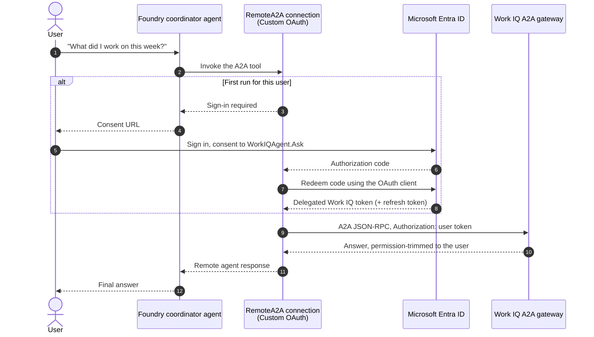

# Work IQ over A2A from an Azure AI Foundry agent

Ask an **Azure AI Foundry** agent a question, and have it answer using **Microsoft Work IQ** —
Copilot's reasoning layer over your Microsoft 365 data (mail, meetings, files, chats).

The Foundry agent calls Work IQ over the [Agent2Agent (A2A) protocol](https://a2a-protocol.org/latest/)
using **OAuth identity passthrough**, so Work IQ answers as *the signed-in user* and returns only
data that user is already permitted to see. No Microsoft 365 data is copied, indexed, or cached
anywhere in your subscription.

```console
$ uv run -m work_iq_a2a_foundry "What did I work on this week?"
project endpoint : https://aif-a1b2c3.services.ai.azure.com/api/projects/work-iq-a2a
connection       : work-iq-a2a
model deployment : gpt-5.4-mini
agent name       : work-iq-coordinator
------------------------------------------------------------
[agent] created temporary version 1
[a2a] calling remote agent via 'work-iq-a2a'
This week you spent most of your time on the Q3 planning review...
```

## What this sample shows

| Concept | Where |
| --- | --- |
| Attaching a remote A2A agent as a Foundry agent tool | [`runner.py`](./src/work_iq_a2a_foundry/runner.py) |
| Custom OAuth identity passthrough on a `RemoteA2A` connection | [`setup_work_iq_connection.py`](./scripts/setup_work_iq_connection.py) |
| Handling the first-run sign-in/consent round trip | [`events.py`](./src/work_iq_a2a_foundry/events.py) |
| Provisioning the whole thing with one command | [`azure.yaml`](./azure.yaml), [`infra/`](./infra) |
| Proving the path works end to end | [`tests/test_e2e.py`](./tests/test_e2e.py) |

## How it works



The key idea is **token ownership**. Your code never handles a Work IQ token. Foundry owns the
OAuth exchange and token refresh for the connection, and passes the signed-in user's delegated
token to Work IQ on every call.

### Reading the response stream

Foundry agents stream over the **OpenAI Responses API**, so the sample works with typed SDK
models rather than raw dictionaries. `AIProjectClient.get_openai_client()` returns an `OpenAI`
client, and `responses.create(stream=True)` yields typed events that
[`events.py`](src/work_iq_a2a_foundry/events.py) dispatches on directly:

| Typed event | Sample behaviour |
| --- | --- |
| `ResponseTextDeltaEvent` | Append `.delta` to the answer and echo it |
| `ResponseOutputItemAddedEvent` / `...DoneEvent` | Detect the call out to Work IQ |
| `ResponseCompletedEvent` | Finish the run |
| `ResponseFailedEvent` / `ResponseErrorEvent` / `ResponseIncompleteEvent` | Extract a typed error message |

On a representative run, 95 of 100 stream events were handled through these classes and the
remaining 5 were also typed SDK events the sample simply does not need to branch on.

Two things have no SDK model yet, and are the only places the sample reads untyped data:

- **The A2A tool-call item.** The typed `ResponseOutputItemAddedEvent` envelope carries an item
  whose `type` is `a2a_preview_call`, which the OpenAI SDK does not model. The sample compares
  that one string against a named constant rather than inventing a local model.
- **The OAuth sign-in payload** Foundry emits when a connection has no delegated token yet.

Elsewhere the sample stays on SDK types: `agents.create_version()` is typed as
`AgentVersionDetails`, and credentials are typed as `azure.core.credentials.TokenCredential`.

> **Why the connection is created with `az rest`.** `ConnectionsOperations` in
> `azure-ai-projects` is read-only — it exposes `get`, `get_default`, and `list`, but no create.
> Creating the `RemoteA2A` connection therefore goes through the ARM control plane in
> [`setup_work_iq_connection.py`](scripts/setup_work_iq_connection.py). Everything the sample
> does at runtime uses the SDK.

## Prerequisites

**Tooling**

| Tool | Why | Install |
| --- | --- | --- |
| [Azure Developer CLI](https://aka.ms/azd) (`azd`) | Provisions everything | `winget install microsoft.azd` / `brew install azd` |
| [Azure CLI](https://learn.microsoft.com/cli/azure/install-azure-cli) (`az`) | Entra app + connection setup | see link |
| [uv](https://docs.astral.sh/uv/) | Python dependency management | `winget install astral-sh.uv` / `brew install uv` |
| Python 3.10+ | Runs the sample | installed by `uv` |

**Azure**

- An Azure subscription, and permission to create resources in it.
- Quota for the model you deploy (`gpt-5.4-mini` by default) in your chosen region.
- A region that supports Foundry Agent Service — for example `eastus2`, `westus`, or `swedencentral`.

**Microsoft Entra**

- The **Cloud Application Administrator** role (or higher) in the tenant, so the setup script can
  create an app registration and grant admin consent for `WorkIQAgent.Ask`.
  If you do not hold that role, see [Splitting the admin step](#splitting-the-admin-step).

**Microsoft 365**

- The user who signs in must have a **Microsoft 365 Copilot license**. Work IQ returns `403` without one.
- Work IQ is in public preview. See the
  [Work IQ documentation](https://learn.microsoft.com/microsoft-365/copilot/extensibility/work-iq/)
  for current availability.

## Quickstart

```bash
git clone https://github.com/mattgotteiner/samples.git
cd samples/work-iq-a2a-foundry

az login                    # Entra + ARM operations
azd auth login              # provisioning
azd up                      # ~5 minutes
```

`azd up` prompts for an environment name, subscription, and region, then:

1. deploys a Foundry account, a project, and a `gpt-5.4-mini` deployment,
2. grants you the **Foundry User** role on the account,
3. creates a confidential-client Entra app and grants admin consent for `WorkIQAgent.Ask`,
4. creates the `RemoteA2A` connection to `https://workiq.svc.cloud.microsoft/a2a/`,
5. registers the connection's redirect URI back onto the app.

Then run the sample:

```bash
uv sync
uv run -m work_iq_a2a_foundry "What did I work on this week?"
```

**The first run prints a sign-in URL and exits with code 2.** That is expected — Foundry needs a
delegated Work IQ token for you before it can call Work IQ. Open the URL in a browser, sign in as
the user whose Microsoft 365 data you want to use, complete consent, then run the command again.
Subsequent runs reuse the stored token.

### Configuration

`azd` writes everything the sample needs into its environment, so no manual copying is required.
To run outside of `azd`, copy [`.env.example`](./.env.example) to `.env` and fill it in, or export
the same variables:

| Variable | Required | Meaning |
| --- | --- | --- |
| `AZURE_AI_PROJECT_ENDPOINT` | yes | `https://<resource>.services.ai.azure.com/api/projects/<project>` |
| `WORK_IQ_CONNECTION_NAME` | yes | Name of the `RemoteA2A` connection |
| `AZURE_AI_MODEL_DEPLOYMENT_NAME` | yes | Model deployment used by the coordinator agent |
| `AZURE_TENANT_ID` | no | Force a tenant when you are signed in to several |
| `WORK_IQ_PROMPT` | no | Default question |
| `WORK_IQ_EVENT_LOG_PATH` | no | Append the raw event stream as JSON Lines |
| `WORK_IQ_TIMEOUT_SECONDS` | no | Per-response timeout, default `300` |

Exit codes: `0` success, `1` failure, `2` sign-in required, `3` configuration error.

## Testing

Offline unit tests need no Azure resources and run in CI:

```bash
uv run pytest -m "not e2e"
```

The end-to-end test exercises the real path — agent, A2A tool, OAuth connection, Work IQ — and
asserts that Work IQ returned text. Run it after `azd up` and after completing consent once:

```bash
uv run pytest -m e2e -v
```

It fails with the sign-in URL if consent has not been completed, because an unconsented
connection cannot prove the end-to-end path.

## Cost and cleanup

The Foundry account itself has no standing charge; you pay per token against the model
deployment, so an idle environment costs approximately nothing. Delete everything with:

```bash
azd down --purge
```

This also deletes the Entra app registration that provisioning created. Verify it is gone:

```bash
az ad app list --display-name "work-iq-a2a-foundry-<your-env-name>" -o table
```

## Troubleshooting

| Symptom | Cause | Fix |
| --- | --- | --- |
| Sample exits with code `2` and prints a URL | No delegated Work IQ token stored yet | Open the URL as the target user, consent, run again |
| `403` from Work IQ, no scope message | Signed-in user has no Microsoft 365 Copilot license | Assign the license, wait 15–30 minutes for propagation |
| `Unsupported A2A modality. Only text modality is supported.` | Older SDK sent non-text A2A parts | `uv lock --upgrade-package azure-ai-projects` |
| Admin consent step fails during `azd up` | You lack Cloud Application Administrator | See [Splitting the admin step](#splitting-the-admin-step) |
| `Tenant provided in token does not match` | Signed in to the wrong tenant | `az login --tenant <project-tenant-id>`, set `AZURE_TENANT_ID` |
| Agent answers without calling the tool | Connection name mismatch | Confirm `WORK_IQ_CONNECTION_NAME` matches the connection in the project |
| `does not have authorization to perform action` | Missing role on the Foundry account | Assign **Foundry User** on the account |
| Deployment fails on model quota | No capacity for the model in that region | Set `AZURE_AI_MODEL_NAME` / `AZURE_AI_MODEL_CAPACITY`, or pick another region |

To capture the raw exchange for a bug report:

```bash
WORK_IQ_EVENT_LOG_PATH=out/events.jsonl uv run -m work_iq_a2a_foundry
```

The log contains the full event stream. Review it before sharing — it includes the model's output.

### Splitting the admin step

If you cannot grant admin consent yourself, run `azd provision`, let the consent step fail, then
ask a tenant admin to run the command printed in the error:

```bash
az ad app permission admin-consent --id <app-id>
```

Then re-run `azd provision`. The script is idempotent and picks up where it left off.

## Security notes

- The setup script creates a **client secret** for the Entra app. `azd` stores it in the local
  `.azure/` directory, which is git-ignored. Treat it as sensitive and run `azd down` when done.
- The connection is created with `isSharedToAll`, so any user of the project can use it — but each
  user signs in separately and only ever sees their own Microsoft 365 data.
- This is sample code for learning and evaluation, not a production-hardened deployment.

## Related reading

- [Connect to an A2A agent endpoint from Foundry Agent Service](https://learn.microsoft.com/azure/foundry/agents/how-to/tools/agent-to-agent)
- [Agent2Agent (A2A) authentication in Foundry](https://learn.microsoft.com/azure/foundry/agents/concepts/agent-to-agent-authentication)
- [Work IQ documentation](https://learn.microsoft.com/microsoft-365/copilot/extensibility/work-iq/)
- [`microsoft/work-iq-samples`](https://github.com/microsoft/work-iq-samples) — calling Work IQ A2A directly, without Foundry

## License

MIT. See [LICENSE](../LICENSE).
